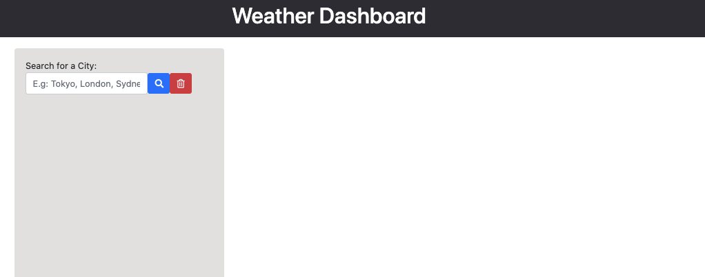
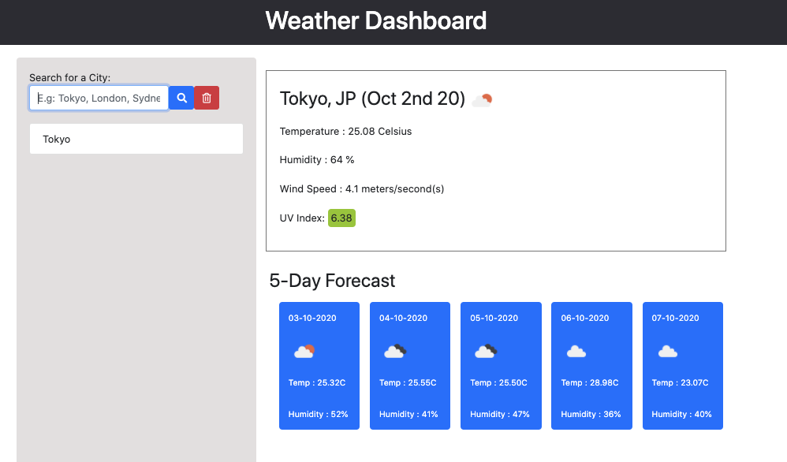
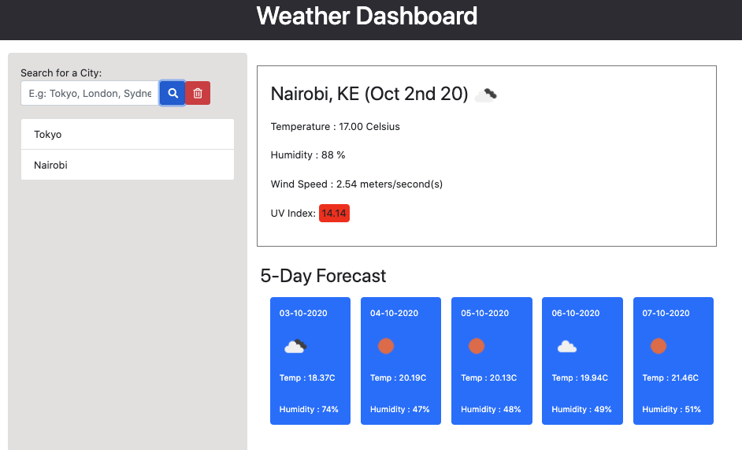

## Server-Side APIs: Weather Dashboard

Developers are often tasked with retrieving data from another application's API and using it in the context of their own. Third-party APIs allow developers to access their data and functionality by making requests with specific parameters to a URL. This app lets you build a weather dashboard that will run in the browser and feature dynamically updated HTML and CSS.

I have used the [OpenWeather API](https://openweathermap.org/api) to retrieve weather data for cities. 

## Screenshots

Screenshot1) UI. the user is given the textarea to input the city name.

Screenshot2) the app outputs the current weather and 5-day forecast. 

Screenshot3) the app stores the search history. the Delete button would erase all history as well. 

## Tech used

- HTML
- CSS
- JavaScript
- jQuery
- Boostrap
- Moment.js
- OpenWeather API

## Deployment

https://noriyuki-ishii-820.github.io/ServerSideAPIs-Weather-Dashboard/

## Lisence

MIT 

## Contact
email me! nishii.dev.syd@gmail.com
